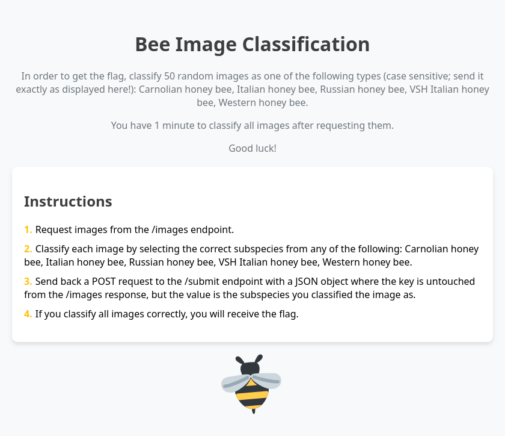

# 2be||!2bee

I would rate this a harder misc/machine learning challenge.

> Y'all remember the qbittorrent honeypot from last year? Some sentence has it: where there's a honeypot, there's a bee! I've been working on a new honeypot, and some bees started attacking me. I need to know exactly which bee is what type, so I can tell the GP later. Can you help me out?
>
> Looking for instructions? Everything you need is explained once you find the service.
>
> Fancy a GPU? While it's not strictly necessary to be able to solve the challenge, if you think you need one, I can recommend [Google Colab](https://colab.research.google.com/) for free GPU access or apparently [Kaggle](https://www.kaggle.com/code/dansbecker/running-kaggle-kernels-with-a-gpu) has some free GPU access as well. Alhough the challenge author has never tried the latter.
>
> Port is 8080.

## How to run

The image was tested with podman, but should work fine with docker as well.

0. Clone the repo and cd to the root folder of the particular challenge
1. Build the image: `podman build -t ctf-2beornot2bee:latest .`
2. Run the image: `podman rm -f ctf-2beornot2bee:latest; podman run --name ctf-2beornot2bee -it --rm -p 8080:8080 ctf-2beornot2bee:latest`

Connect on port 8080.

<details>
<summary>Writeup (Spoiler)</summary>

<p align="center">
    
    <br />
    <i>The instructions the site tells us</i>
</p>

Once we connect, we see a static website telling us the following instructions:


### Instructions
 1. Request images from the /images endpoint.
 2. Classify each image by selecting the correct subspecies from any of the following: Carniolan honey bee, Italian honey bee, Russian honey bee, VSH Italian honey bee, Western honey bee.
 3. Send back a POST request to the /submit endpoint with a JSON object where the key is untouched from the /images response, but the value is the subspecies you classified the image as.
 4. If you classify all images correctly, you will receive the flag.

So we have a `/images` endpoint which indeed returns a JSON object with image names as keys and the image data as values. We can see that the images are actually base64 encoded. The site also has this comment:

```html
<!-- Credits go to kaggle.com for the dataset -->
```

Meaning we need to look around on Kaggle for the matching dataset. Luckily the first notebook that pops up for me when I look up `bee` or `bee classification`, is this [notebook](https://www.kaggle.com/code/gpreda/honey-bee-subspecies-classification). Upon first look the included dataset has all the subspecies the instructions mention. We can even make an assumption that the backend uses the same dataset, if the subspecies match.

Recognizing 50 out of 50 images is a quite challenging task. But we have the full dataset so we can try to cheat and write some script that calculates some hash (like sha256) of the base64 encoded image and then compares it to the calculated hashes from the dataset images. This way we can get the correct subspecies for each image fairly easily. We can then send the POST request to the `/submit` endpoint with the correct data. In fact I have prepared a script for this, you can find it under [poc.py](poc.py).

```sh
[steve@todo ctf-2beornot2bee]$ python3 ./poc.py 
{'O0ZrM3uGBffjyTcfgetm19iTEqh8y_En46_CptRQCyt64OarFEIu0714SMSvZOsI2d6a': 'VSH Italian honey bee', ..., '9BEHiS6FiVlDv0iZ_BUNjadI9TLfQZDmuWX1eACEJ7Zr1lvGyp3Y2mmkScJ9yP2ZzVvQ': 'Russian honey bee'}

Congratulations! Here is the flag: HCSC24{d1d_y0u_f1nd_th3_d4t4s3t_4nd_h4shed_or_d1d_u_use_ml?}
```

And that's it! We have the flag: `HCSC24{d1d_y0u_f1nd_th3_d4t4s3t_4nd_h4shed_or_d1d_u_use_ml?}`.

Or we can go the hard way and actually classify the images. Luckily the same notebook has instructions on how to train a decent model with pretty good accuracy. I took that as an inspiration and with very little changes, I was able to put together some code that may crash sometimes, but should eventually solve the problem. See [poc.ipynb](poc.ipynb) for the full code.

**Note**: The dataset contains too much Italian honey bees, so the `/images` endpoint was adjusted to return at least two different subspecies in all cases. Likewise the `/submit` endpoint will accept answers that are correct for at least two different subspecies. So one cannot just send a response payload with all Italian honey bees and have it running until they get the flag. *Valve level anti-cheat* I know, but should be okay and shouldn't hurt legitimate players.

I also added a time limit of 1 minute for each token, to make permutation based brute force attacks harder.

I can still imagine a way to solve this problem using a different method, but that's quite tricky. Basically the solver needs to pick a random subspecies. Let's say we pick `Italian honey bee`. Then they do multiple requests to `/images`, fetch a bunch of images and send a randomly picked 50 of them to the `/submit` endpoint with an assumption that all 50 are `Italian honey bee`. If that's correct, the server will tell them `Technically you classified all images correctly, but you need to classify at least 2 different species.`. So they know that all 50 images were indeed `Italian honey bee`. Then they can repeat the process until they have a handful of `Italian honey bee` images if not all. Since the base64 value doesn't change, matching is trivial. Then they need some other random base64 and they need to send ie. `Russian honey bee` for that single piece and they need to return 49 more images that were previously surely classified as `Italian honey bee`. If that's correct, they get the flag, if it isn't, they can repeat the process with another subspecies. Since the backend needs two different subspecies and 50 correctly guessed items altogether. Therefore 49 `Italian honey bee`s and 1 other bee should suffice. Of course the token expires in 1 minute, so they may need to re-fetch tokens for the given base64 values. It's possible, it's cheating, but if they go thru all that hassle, I think they deserve the flag. So this 'backdoor' remains unpatched.

And of course they can rely on some pay2win service like Google Cloud Vision API or Azure and whatsoever, but I don't think that will have a decent success rate... Reverse image search APIs might work, but also a weird approach. I am curious if anyone is able to solve this challenge that way.

</details>
