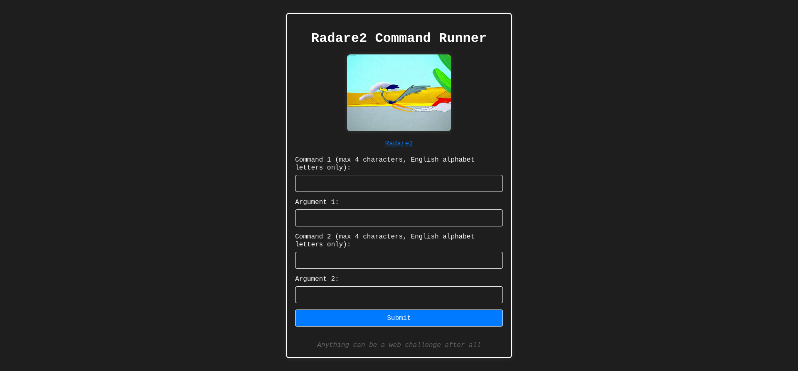

# Patch Adams

A little twisted, but overall not too complicated reverse challenge.

> Welcome champ! There are countless great tools to help a hacker on their reverse engineering journey. We have Ghidra, IDA, binutils, gdb, radare2, and many more. Every great hacker must know radare2 to some extent! So I prepared an environment for you. Let's see if you can find the flag!
>
> Don't forget to check out the `main.go` source.
>
>> Please note that this challenge runs on an experimental platform where you have to spawn your own container. We suggest that you start with the Tutorial challenge first to get familiar with it.
>>
>> Also note that due to the experimantal nature, we cannot take any responsibility. If you encounter any issues, please let us know and we will try to help you as best as we can.
>>
>> You may have one container running at a time and the containers run for 2 hours. If you need more time, you can always spawn it again.
>>
>> In case your IP changes, you will need to respawn your container.
>>
>> **Abuse from within the container is strictly forbidden. DoSsing, attempts to break out of the container, or any other malicious activity will result in a ban from the entire competition!**

## How to run

The image was tested with podman, but should work fine with docker as well.

1. Clone the repo and cd to the root folder of the particular challenge
2. Build the image: `podman build -t ctf-patch_adams:latest .`
3. Run the image: `podman rm -f ctf-patch_adams:latest; podman run -it --rm -p 8080:8080 ctf-patch_adams:latest`

<details>
<summary>Writeup (Spoiler)</summary>

If we visit `http://127.0.0.1:8080`, we can see the following:

<p align="center">
    
    <br />
    <i>Main page that asks for commands</i>
</p>

We can enter two radare2 commands and those will be executed. We are in control of the command and the arguments. However there are some constraints in place. If we check the source, we see:

```go
func isValidCommand(command string) bool {
	if len(command) > 4 {
		return false
	}
	var blackList = []string{"cat", "ls", "lu", "ll", "lr", "le", "pwd", "cd"}
	for _, black := range blackList {
		if strings.ToLower(command) == black {
			return false
		}
	}
	match, _ := regexp.MatchString("^[a-zA-Z0-9]+$", command)
	return match
}

func isValidArgument(argument string) bool {
	if len(argument) > 16 {
		return false
	}
	match, _ := regexp.MatchString("^[a-zA-Z0-9 ]*$", argument)
	return match
}
```

In a nutshell, the command must be at most 4 characters long and the argument must be at most 16 characters long. The command must not be on the blacklist and the argument must match the regex `^[a-zA-Z0-9 ]*$`, whereas the command must match the regex `^[a-zA-Z0-9]+$`.

We can also see that these are the commands being run whenever we submit the form:

```go
r2Commands := []string{
    "oo+",
    "e cfg.sandbox=all", // idea from pancake
    "aaaa",
    fmt.Sprintf("%s %s", command1, argument1),
    fmt.Sprintf("%s %s", command2, argument2),
}
```

We can see that the binary is opened first with `oo+` which is a command to open the binary in read-write mode. That alone, and the hint `patch` in the challenge name alone should give us a hint that we can patch the binary. Next the sandbox is set to `all` which means we won't be able to use commands that use network, file system, etc. So we cannot just execute `cat flag.txt` for example. Lastly, the `aaaa` command is run which is a command to analyze the binary. And then the two commands we entered are run.

Alright, we can also see that the source copies the `adams` binary to a temporary location, opens it for us in radare2 and when it executed all commands, the binary is even executed and we get the output back.

If I just supply `h` as the first command and `h` as the second command (that command doesn't seem to do anything), I get:

```
Radare2 Output:


Final Binary Output:
Unauthorized
```

Now we observed the binary's natural behavior. However it's kind of a blackbox as we didn't receive the binary nor its source code. First I had the idea that I will just try to find a way to dump the binary and then analyze it locally so I know what does it do. Apparently the command `pxj` can give us a JSON bytearray which we can combine with `s` to seek through the entire file and save its content. If we just run `pxj` without any arguments passed and `h` as the second command again, we get:

```
Radare2 Output:
[72,49,237,72,137,231,72,141,53,203,44,0,0,72,131,228,240,232,0,0,0,0,139,55,72,141,87,8,76,141,5,130,3,0,0,69,49,201,72,141,13,3,255,255,255,72,141,61,41,3,0,0,233,183,255,255,255,15,31,128,0,0,0,0,72,141,61,241,46,0,0,72,141,5,234,46,0,0,72,57,248,116,21,72,139,5,198,46,0,0,72,133,192,116,9,255,224,15,31,128,0,0,0,0,195,15,31,128,0,0,0,0,72,141,61,193,46,0,0,72,141,53,186,46,0,0,72,41,254,72,137,240,72,193,238,63,72,193,248,3,72,1,198,72,209,254,116,20,72,139,5,125,46,0,0,72,133,192,116,8,255,224,102,15,31,68,0,0,195,15,31,128,0,0,0,0,128,61,153,46,0,0,0,117,71,85,72,131,61,70,46,0,0,0,72,137,229,116,13,72,139,61,98,46,0,0,255,21,52,46,0,0,232,103,255,255,255,72,131,61,47,46,0,0,0,116,13,72,141,61,102,20,0,0,255,21,32,46,0,0,198,5,89,46,0,0,1,93,195,15,31,128,0,0,0,0]

Final Binary Output:
Unauthorized
```

The only issue with that is that if we seek out of the binary and request `pxj`, it will give us a bunch of 255s. Therefore we need to know the size of the binary. Thankfully the command `o` can give that to us:

```
Radare2 Output:
3 * rwx 0x00003710 /tmp/adams_5594
 4 - rw- 0x00000068 null://104
 5 - rw- 0x000f0000 malloc://983040

Final Binary Output:
Unauthorized
```

We can see that the binary is at `/tmp/adams_2731` and its size is `0x00003710`. So we can seek and download the file until we have its entire content. I got a script that does just that: [here](assets/dump_binary.py). That one uses `cX` instead of `pxj` to dump the binary in hex, but I have one with `pxj` as well: [here](assets/dump_binary2.py).

But neither of these dumps seem to be fully equal to the loaded binary, many sections are missing and the last part of the elf file is just padding. I assume `r2` tries to analyze the file and doesn't return parts it didn't analyze/recognize etc.

So this is probably not the intended way. Since `r2` is huge, we have countless options, but we can check the strings first using the `izz` command. If we run `izz` and `h` as the second command, we get:

```
[...]
[Strings]
nth paddr      vaddr      len size section   type    string
-----------------------------------------------------------
0   0x00000034 0x00000034 4   10             utf16le @8\r@
1   0x00000318 0x00000318 24  25   .interp   ascii   /lib/ld-musl-x86_64.so.1
2   0x00000581 0x00000581 5   6    .dynstr   ascii   srand
3   0x00000587 0x00000587 5   6    .dynstr   ascii   fopen
4   0x0000058d 0x0000058d 4   5    .dynstr   ascii   puts
5   0x00000592 0x00000592 4   5    .dynstr   ascii   time
6   0x00000597 0x00000597 16  17   .dynstr   ascii   __stack_chk_fail
7   0x000005a8 0x000005a8 5   6    .dynstr   ascii   fgets
8   0x000005ae 0x000005ae 6   7    .dynstr   ascii   fclose
9   0x000005b5 0x000005b5 6   7    .dynstr   ascii   fscanf
10  0x000005bc 0x000005bc 5   6    .dynstr   ascii   _init
11  0x000005c2 0x000005c2 5   6    .dynstr   ascii   _fini
12  0x000005c8 0x000005c8 14  15   .dynstr   ascii   __cxa_finalize
13  0x000005d7 0x000005d7 6   7    .dynstr   ascii   strcmp
14  0x000005de 0x000005de 17  18   .dynstr   ascii   __libc_start_main
15  0x000005f0 0x000005f0 21  22   .dynstr   ascii   libc.musl-x86_64.so.1
16  0x00000606 0x00000606 23  24   .dynstr   ascii   __deregister_frame_info
17  0x0000061e 0x0000061e 25  26   .dynstr   ascii   _ITM_registerTMCloneTable
18  0x00000638 0x00000638 27  28   .dynstr   ascii   _ITM_deregisterTMCloneTable
19  0x00000654 0x00000654 21  22   .dynstr   ascii   __register_frame_info
20  0x00001187 0x00001187 4   5    .text     ascii   uGUH
21  0x000011e8 0x000011e8 4   5    .text     ascii   t&UH
22  0x00002000 0x00002000 12  13   .rodata   ascii   Unauthorized
23  0x00002010 0x00002010 116 117  .rodata   ascii   You treat a disease, you win, you lose. You treat a person, I guarantee you, you'll win, no matter what the outcome.
24  0x00002088 0x00002088 271 272  .rodata   ascii   I love you without knowing how, or when, or from where. I love you straightforwardly without complexities or pride. I love you because I know no other way then this. So close that your hand, on my chest, is my hand. So close, that when you close your eyes, I fall asleep.
25  0x00002198 0x00002198 66  67   .rodata   ascii   Our job is improving the quality of life, not just delaying death.
26  0x000021e0 0x000021e0 116 117  .rodata   ascii   You're focusing on the problem. If you focus on the problem, you can't see the solution. Never focus on the problem!
27  0x00002258 0x00002258 319 320  .rodata   ascii   What's wrong with death sir? What are we so mortally afraid of? Why can't we treat death with a certain amount of humanity and dignity, and decency, and God forbid, maybe even humor. Death is not the enemy gentlemen. If we're going to fight a disease, let's fight one of the most terrible diseases of all, indifference.
28  0x00002398 0x00002398 138 139  .rodata   ascii   See what no one else sees. See what everyone chooses not to see... out of fear, conformity or laziness. See the whole world anew each day!
29  0x00002428 0x00002428 73  74   .rodata   ascii   We can head on down to the maternity ward. You know those chicks put out.
30  0x00002478 0x00002478 60  61   .rodata   ascii   We need to start treating the patient as well as the disease
31  0x000024b8 0x000024b8 128 129  .rodata   ascii   I wanted to become a doctor so I could serve others. And because of that, I've lost everything. But I've also gained everything.
32  0x0000253b 0x0000253b 13  14   .rodata   ascii   /etc/hostname
33  0x0000254c 0x0000254c 8   9    .rodata   ascii   adams-pc
34  0x00002558 0x00002558 30  31   .rodata   ascii   Error: /etc/hostname not found
35  0x00002577 0x00002577 16  17   .rodata   ascii   /secret/flag.txt
36  0x00002588 0x00002588 25  26   .rodata   ascii   Error: flag.txt not found
37  0x000025f0 0x000025f0 4   5    .eh_frame ascii   \e\f\a\b
38  0x00002617 0x00002617 5   6    .eh_frame ascii   ;*3$"
39  0x00002639 0x00002639 4   5    .eh_frame ascii   Q\f\a\b
40  0x000026ba 0x000026ba 4   5    .eh_frame ascii   C\f\a\b
41  0x00003008 0x00000000 48  49   .comment  ascii   GCC: (Alpine 13.2.1_git20231014) 13.2.1 20231014
42  0x0000303a 0x00000001 9   10   .shstrtab ascii   .shstrtab
43  0x00003044 0x0000000b 7   8    .shstrtab ascii   .interp
44  0x0000304c 0x00000013 18  19   .shstrtab ascii   .note.gnu.property
45  0x0000305f 0x00000026 18  19   .shstrtab ascii   .note.gnu.build-id
46  0x00003072 0x00000039 9   10   .shstrtab ascii   .gnu.hash
47  0x0000307c 0x00000043 7   8    .shstrtab ascii   .dynsym
48  0x00003084 0x0000004b 7   8    .shstrtab ascii   .dynstr
49  0x0000308c 0x00000053 9   10   .shstrtab ascii   .rela.dyn
50  0x00003096 0x0000005d 9   10   .shstrtab ascii   .rela.plt
51  0x000030a0 0x00000067 5   6    .shstrtab ascii   .init
52  0x000030a6 0x0000006d 5   6    .shstrtab ascii   .text
53  0x000030ac 0x00000073 5   6    .shstrtab ascii   .fini
54  0x000030b2 0x00000079 7   8    .shstrtab ascii   .rodata
55  0x000030ba 0x00000081 13  14   .shstrtab ascii   .eh_frame_hdr
56  0x000030c8 0x0000008f 9   10   .shstrtab ascii   .eh_frame
57  0x000030d2 0x00000099 11  12   .shstrtab ascii   .init_array
58  0x000030de 0x000000a5 11  12   .shstrtab ascii   .fini_array
59  0x000030ea 0x000000b1 8   9    .shstrtab ascii   .dynamic
60  0x000030f3 0x000000ba 4   5    .shstrtab ascii   .got
61  0x000030f8 0x000000bf 5   6    .shstrtab ascii   .data
62  0x000030fe 0x000000c5 4   5    .shstrtab ascii   .bss
63  0x00003103 0x000000ca 8   9    .shstrtab ascii   .comment
[...]
```

Unfortunately this doesn't give out the flag just yet, but we can see that the binary was compiled on Alpine, it has some hostname check probably and a few strings that hint to a function which may be responsible for flag reading. There is also the `Unauthorized` string which we probably saw earlier. That's pretty much all the info we could get from the strings.

Time to check the functions. We can do that with the `afl` command. If we run `afl` and `h` as the second command, we get:

```
[...]
0x000010d0    1     57 entry0
0x00001000    1      3 sym._init
0x00001475    1      3 sym._fini
0x00001020    1      6 sym.imp.fscanf
0x00001030    1      6 sym.imp.fgets
0x00001040    1      6 sym.imp.puts
0x00001050    1      6 sym.imp.__stack_chk_fail
0x00001060    1      6 sym.imp.rand
0x00001070    1      6 sym.imp.fopen
0x00001080    1      6 sym.imp.srand
0x00001090    1      6 sym.imp.fclose
0x000010a0    1      6 sym.imp.time
0x000010b0    1      6 sym.imp.strcmp
0x000010c0    1      6 sym.imp.__libc_start_main
0x000011e0    7     96 entry.init0
0x00001180    7     74 entry.fini0
0x00001110    4     34 fcn.00001110
0x000012ec    8    177 fcn.000012ec
0x0000122b    3    193 fcn.0000122b
0x00001215    1     22 fcn.00001215
0x0000139d    6    144 fcn.0000139d
0x0000142d    4     72 fcn.0000142d
[...]
```

A lot more info! First we can notice that we have a stack canary. Then we have some imports, some entries and some functions. The fact that the `fcn.` functions are not named suggest that the binary was also stripped. We can seek to each function and check their content. I am running `s` with `0x00001110` argument and `pdf` with no arguments first.

`fcn.00001110` doesn't seem too interesting:

```
            ; CALL XREF from entry.fini0 @ 0x11a4(x)
/ 34: fcn.00001110 ();
|           0x00001110      488d3df12e00.  lea rdi, [0x00004008]
|           0x00001117      488d05ea2e00.  lea rax, [0x00004008]
|           0x0000111e      4839f8         cmp rax, rdi
|       ,=< 0x00001121      7415           je 0x1138
|       |   0x00001123      488b05c62e00.  mov rax, qword [reloc._ITM_deregisterTMCloneTable] ; [0x3ff0:8]=0
|       |   0x0000112a      4885c0         test rax, rax
|      ,==< 0x0000112d      7409           je 0x1138
|      ||   0x0000112f      ffe0           jmp rax
..
|      ||   ; CODE XREFS from fcn.00001110 @ 0x1121(x), 0x112d(x)
\      ``-> 0x00001138      c3             ret
```

`fcn.000012ec` is more interesting:

```

            ; CALL XREF from fcn.0000142d @ 0x1447(x)
/ 177: fcn.000012ec ();
|           ; var int64_t canary @ rbp-0x8
|           ; var char *s1 @ rbp-0x20
|           ; var file*stream @ rbp-0x28
|           0x000012ec      55             push rbp
|           0x000012ed      4889e5         mov rbp, rsp
|           0x000012f0      4883ec30       sub rsp, 0x30
|           0x000012f4      64488b042528.  mov rax, qword fs:[0x28]
|           0x000012fd      488945f8       mov qword [canary], rax
|           0x00001301      31c0           xor eax, eax
|           0x00001303      488d052f1200.  lea rax, [0x00002539]       ; "r"
|           0x0000130a      4889c6         mov rsi, rax                ; const char *mode
|           0x0000130d      488d05271200.  lea rax, str._etc_hostname  ; 0x253b ; "/etc/hostname"
|           0x00001314      4889c7         mov rdi, rax                ; const char *filename
|           0x00001317      e854fdffff     call sym.imp.fopen          ; file*fopen(const char *filename, const char *mode)
|           0x0000131c      488945d8       mov qword [stream], rax
|           0x00001320      48837dd800     cmp qword [stream], 0
|       ,=< 0x00001325      744c           je 0x1373
|       |   0x00001327      488d55e0       lea rdx, [s1]               ;  ...
|       |   0x0000132b      488b45d8       mov rax, qword [stream]
|       |   0x0000132f      488d0d131200.  lea rcx, [0x00002549]       ; "%s"
|       |   0x00001336      4889ce         mov rsi, rcx                ; const char *format
|       |   0x00001339      4889c7         mov rdi, rax                ; FILE *stream
|       |   0x0000133c      b800000000     mov eax, 0
|       |   0x00001341      e8dafcffff     call sym.imp.fscanf         ; int fscanf(FILE *stream, const char *format, ...)
|       |   0x00001346      488b45d8       mov rax, qword [stream]
|       |   0x0000134a      4889c7         mov rdi, rax                ; FILE *stream
|       |   0x0000134d      e83efdffff     call sym.imp.fclose         ; int fclose(FILE *stream)
|       |   0x00001352      488d45e0       lea rax, [s1]
|       |   0x00001356      488d15ef1100.  lea rdx, str.adams_pc       ; 0x254c ; "adams-pc"
|       |   0x0000135d      4889d6         mov rsi, rdx                ; const char *s2
|       |   0x00001360      4889c7         mov rdi, rax                ; const char *s1
|       |   0x00001363      e848fdffff     call sym.imp.strcmp         ; int strcmp(const char *s1, const char *s2)
|       |   0x00001368      85c0           test eax, eax
|      ,==< 0x0000136a      7516           jne 0x1382
|      ||   0x0000136c      b801000000     mov eax, 1
|     ,===< 0x00001371      eb14           jmp 0x1387
|     |||   ; CODE XREF from fcn.000012ec @ 0x1325(x)
|     ||`-> 0x00001373      488d05de1100.  lea rax, str.Error:__etc_hostname_not_found ; 0x2558 ; "Error: /etc/hostname not found"
|     ||    0x0000137a      4889c7         mov rdi, rax                ; const char *s
|     ||    0x0000137d      e8befcffff     call sym.imp.puts           ; int puts(const char *s)
|     ||    ; CODE XREF from fcn.000012ec @ 0x136a(x)
|     |`--> 0x00001382      b800000000     mov eax, 0
|     |     ; CODE XREF from fcn.000012ec @ 0x1371(x)
|     `---> 0x00001387      488b55f8       mov rdx, qword [canary]
|           0x0000138b      64482b142528.  sub rdx, qword fs:[0x28]
|       ,=< 0x00001394      7405           je 0x139b
|       |   0x00001396      e8b5fcffff     call sym.imp.__stack_chk_fail ; void __stack_chk_fail(void)
|       |   ; CODE XREF from fcn.000012ec @ 0x1394(x)
|       `-> 0x0000139b      c9             leave
\           0x0000139c      c3             ret
```

This function opens `/etc/hostname`, reads it, closes it, compares it with `adams-pc` and if it's equal, it returns 1. Otherwise it prints an error message and returns 0. This is probably the function that checks the hostname. We can see that the binary is expecting the hostname to be `adams-pc`. Since we got Unauthorized earlier, we can assume that the hostname is not `adams-pc`. That's a function that we know for sure that it's executed. So that's good. But still not enough.

`fcn.0000122b` isn't too interesting, that contains the ton of quotes we saw earlier. I won't paste it here since that isn't called even.

`fcn.00001215` is the one that prints the Unauthorized message:

```
            ; CALL XREF from fcn.0000142d @ 0x1469(x)
/ 22: fcn.00001215 ();
|           0x00001215      55             push rbp
|           0x00001216      4889e5         mov rbp, rsp
|           0x00001219      488d05e00d00.  lea rax, str.Unauthorized   ; segment.LOAD2
|                                                                      ; 0x2000 ; "Unauthorized"
|           0x00001220      4889c7         mov rdi, rax                ; const char *s
|           0x00001223      e818feffff     call sym.imp.puts           ; int puts(const char *s)
|           0x00001228      90             nop
|           0x00001229      5d             pop rbp
\           0x0000122a      c3             ret
```

Finally there is a function with seemingly no xrefs, `fcn.0000139d`:

```

/ 144: fcn.0000139d ();
|           ; var int64_t var_8h @ rbp-0x8
|           ; var int64_t var_70h @ rbp-0x70
|           ; var int64_t var_78h @ rbp-0x78
|           0x0000139d      55             push rbp
|           0x0000139e      4889e5         mov rbp, rsp
|           0x000013a1      4883c480       add rsp, 0xffffffffffffff80
|           0x000013a5      64488b042528.  mov rax, qword fs:[0x28]
|           0x000013ae      488945f8       mov qword [var_8h], rax
|           0x000013b2      31c0           xor eax, eax
|           0x000013b4      488d057e1100.  lea rax, [0x00002539]       ; "r"
|           0x000013bb      4889c6         mov rsi, rax
|           0x000013be      488d05b21100.  lea rax, str._secret_flag.txt ; 0x2577 ; "/secret/flag.txt"
|           0x000013c5      4889c7         mov rdi, rax
|           0x000013c8      e8a3fcffff     call sym.imp.fopen          ; file*fopen(const char *filename, const char *mode)
|           0x000013cd      48894588       mov qword [var_78h], rax
|           0x000013d1      48837d8800     cmp qword [var_78h], 0
|       ,=< 0x000013d6      742f           je 0x1407
|       |   0x000013d8      488b5588       mov rdx, qword [var_78h]
|       |   0x000013dc      488d4590       lea rax, [var_70h]
|       |   0x000013e0      be64000000     mov esi, 0x64               ; 'd'
|       |   0x000013e5      4889c7         mov rdi, rax
|       |   0x000013e8      e843fcffff     call sym.imp.fgets          ; char *fgets(char *s, int size, FILE *stream)
|       |   0x000013ed      488d4590       lea rax, [var_70h]
|       |   0x000013f1      4889c7         mov rdi, rax
|       |   0x000013f4      e847fcffff     call sym.imp.puts           ; int puts(const char *s)
|       |   0x000013f9      488b4588       mov rax, qword [var_78h]
|       |   0x000013fd      4889c7         mov rdi, rax
|       |   0x00001400      e88bfcffff     call sym.imp.fclose         ; int fclose(FILE *stream)
|      ,==< 0x00001405      eb0f           jmp 0x1416
|      ||   ; CODE XREF from fcn.0000139d @ 0x13d6(x)
|      |`-> 0x00001407      488d057a1100.  lea rax, str.Error:_flag.txt_not_found ; 0x2588 ; "Error: flag.txt not found"
|      |    0x0000140e      4889c7         mov rdi, rax
|      |    0x00001411      e82afcffff     call sym.imp.puts           ; int puts(const char *s)
|      |    ; CODE XREF from fcn.0000139d @ 0x1405(x)
|      `--> 0x00001416      90             nop
|           0x00001417      488b45f8       mov rax, qword [var_8h]
|           0x0000141b      64482b042528.  sub rax, qword fs:[0x28]
|       ,=< 0x00001424      7405           je 0x142b
|       |   0x00001426      e825fcffff     call sym.imp.__stack_chk_fail ; void __stack_chk_fail(void)
|       |   ; CODE XREF from fcn.0000139d @ 0x1424(x)
|       `-> 0x0000142b      c9             leave
\           0x0000142c      c3             ret
```

Bingo! This is the function we need to call. That sounds pretty easy, right? We know that the function is at address `0x0000139d`. Then we can find some address that is within a function that's called for sure and we can just replace some assembly to do the call for us. The previous function responsible for the `Unauthorized` message is at `0x00001215`. It did a `call sym.imp.puts` to print the message. We can replace that with a `call 0x0000139d` to call the function that reads the flag. We can do that with the `wa` command. Originally the `puts` happens at `0x00001223`. We can see that from the disassembly above. So we can seek there using `s` and argument `0x00001223` and then we can replace the `puts` with the `call 0x0000139d` using `wa call 0x0000139d`. We can then submit the form and get the flag:

```
Radare2 Output:


Final Binary Output:
HCSC24{d0ct0r_0r_nOt_U_r3c0v3r3d_7h3_fl4g}
```

Alternatively we can use many other `call` addresses, like `0x00001317` which also give the flag to us.

I prepared a script that tries to locate the `puts` call and replace it with the `call` to the flag function: [here](poc.py).

If we run it, we also get the flag:

```
[steve@todo ctf-patch_adams]$ python3 ./poc.py 
Win function address: 0x139d
Instruction to replace address: 0x1223
Flag: HCSC24{d0ct0r_0r_nOt_U_r3c0v3r3d_7h3_fl4g}
```

Sweet! `HCSC24{d0ct0r_0r_nOt_U_r3c0v3r3d_7h3_fl4g}` is our flag!

</details>