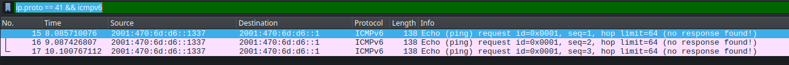
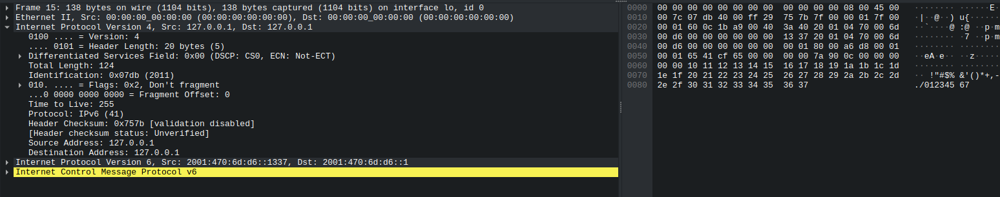
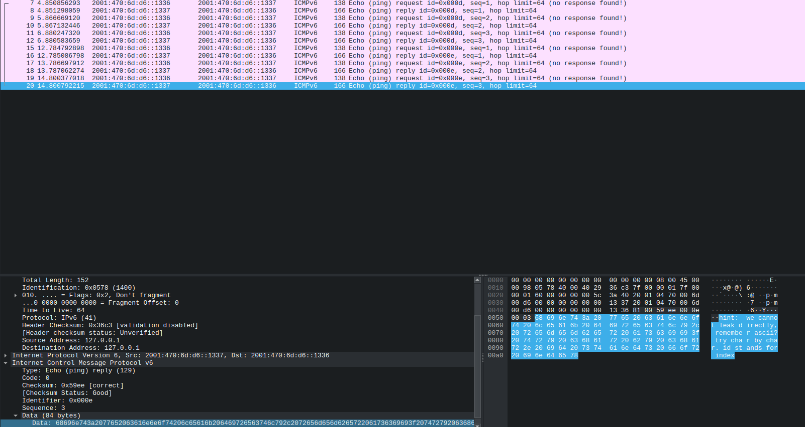

# Return of Jack

Kind of difficult <ins>networking</ins> challenge for those who have not poked with this kind of stuff yet. With a little experience it should be doable.

The following text is given as a starting point. Read this throughly, otherwise its very unlikely that you will figure this one.

> Due to all the hate Jack has received last year, he was caught by the local authorities and got jailed on an island. He is finally ready to face all the consequences and is ready to raise the white flag. However the island has very limited connectivity. In fact the whole island has a special /64 IPv6 range only. Reach him first and we may proceed further on!
>
> ### We know the following details:
> - `2001:470:6d:d6::/64` is the subnet
> - `2001:470:6d:d6::1337` seemingly contains a hint, but cannot be used for anything other than that
> - Jack doesn't know much about networking or developing router firmwares so he only implemented a single *network layer* protocol. If you ask (ID: 128), he might respond (ID: 129). But be aware that its his only chance to communicate with the outer world. He won't be so talkative.
>
> Can't reach the IP on the "clear web" yet? No probs, your first task is a little network OSINT. ;) _Who is_ on the other side?
>
> Still confused?
> Here is a checklist for you:
> 1. Figure out what kind of service is normally on that IPv6 subnet. You will probably need that first.
> 2. What kind of protocol is Jack using? Do you recognize the IDs? You will probably need that second.
> 3. What happens if you use the IPv6 address given in the hint? It may give a hint on how to proceed.
> 4. Profit!
>
> **Note**: When solving the challenge you only need to interact with the IPv4 address given below.
>
> **Note**: Dst only matters when reaching the hint IP. In any other case, you can use any address.
>
> ### Might be useful:
> - https://wireshark.org
> - https://scapy.net/
> - https://datatracker.ietf.org/ links
>
> _Kinda funny. You are going to capture the flag, capture data and rescue the captured Jack at the same time. :D_

## How to run

The image was tested with podman, but should work fine with docker as well.

0. Clone the repo and cd to the root folder of the particular challenge
1. Build the artifacts: `./backend/build.sh build`
2. Build the image: `sudo podman build -t ctf-return_of_jack:latest .`
3. Run the image: `sudo podman rm -f ctf-return_of_jack && sudo podman run --rm -it --net=host --privileged ctf-return_of_jack:latest`

**Note**: It's very important to launch this challenge with root privileges and host networking, otherwise it won't be accessible properly. Under docker the `--privileged` flag isn't neccessary.

I tested this image on a VM with its own external IP. Stuff like OpenStack's Port Security is known to be blocking this.

<details>
<summary>Writeup (Spoiler)</summary>

There is a lot of confusing info in the challenge description. We have a bunch of info that probably leads to network protocols and IPv6. We got an IPv6 address so let's run `whois` on it as the description slightly hints. We get the following:

```
[steve@todo ~]$ whois 2001:470:6d:d6::1337
[...]
contact:ID;I:POC-HE-TSERV-26
contact:Auth-Area:contacts
contact:Class-Name:contact
contact:Name:IPv6 Tunnelbroker
contact:Company:Hurricane Electric
contact:Street-Address:
contact:City:Berlin
contact:Province:
contact:Postal-Code:
contact:Country-Code:DE
contact:Phone:+1-510-580-4100
contact:E-Mail:noc@he.net
contact:Created:20221229130724000
contact:Updated:20221229130724000
contact:Comment:https://tunnelbroker.net/
[...]
```

So we have a hint that the IPv6 address is related to Hurricane Electric's [Tunnelbroker](https://tunnelbroker.net/). After some research it seems to be a public service offering IPv6 to those who don't have it. We can use this to get a public IPv6 address. The underlying protocol they use is 6in4, which is a tunneling protocol. It has a [wikipedia page](https://en.wikipedia.org/wiki/6in4), and this is the [protocol it uses](https://simple.wikipedia.org/wiki/Protocol_41). This is the [corresponding RFC](https://datatracker.ietf.org/doc/html/rfc3056).

It seems quite scary at first to read and process all that, so why don't we just bring up a tunnel ourselves on Linux and see what kind of packets does it craft with the help of Wireshark. We don't actually need to create a valid tunnel as we don't care whether the packets arrive somewhere or not. We just want them created.

```
[root@todo steve]# ip tunnel add test mode sit remote 127.0.0.1 local 127.0.0.1 ttl 255
[root@todo steve]# ip link set test up
[root@todo steve]# ip addr add 2001:470:6d:d6::1336/64 dev test
[root@todo steve]# ip a show dev test
4: test@NONE: <POINTOPOINT,NOARP,UP,LOWER_UP> mtu 65516 qdisc noqueue state UNKNOWN group default qlen 1000
    link/sit 127.0.0.1 peer 127.0.0.1
    inet6 2001:470:6d:d6::1336/64 scope global 
       valid_lft forever preferred_lft forever
    inet6 fe80::7f00:1/64 scope link 
       valid_lft forever preferred_lft forever
[root@todo steve]# ip -6 route add default dev test
[root@todo steve]#
```

Now we brang up the interface to connect from our local 127.0.0.1 and connect to the "remote" 127.0.0.1 host, gave it an IP and set it as the default route. We are ready to launch wireshark.

I will apply the following filter: `ip.proto == 41 && icmpv6`

And send a bunch of pings to a random IPv6:

```
[root@todo steve]# ping 2001:470:6d:d6::1
PING 2001:470:6d:d6::1 (2001:470:6d:d6::1) 56 data bytes
^C
--- 2001:470:6d:d6::1 ping statistics ---
3 packets transmitted, 0 received, 100% packet loss, time 2015ms
```

These will fail as discussed earlier, but wireshark should still display the attempts:

<p align="center">
    
    <br />
    <i>List of failed ICMP pings in Wireshark</i>
</p>

Let's pick one of them and see how they are crafted:

<p align="center">
    
    <br />
    <i>Wireshark details view of the ICMPv6 packet with the IPv4 header expanded</i>
</p>

Doesn't seem to be too scary anymore, does it? Apparently 6to4 encapsulates the IPv6 packet into an IPv4 packet. The IPv4 packet has a protocol field of 41, which is the protocol number for IPv6. The IPv6 packet is then extracted and processed by the receiving end.

Now we can either implement the whole tunnelling on the application level and better understand how this all works, or we can try the lazy way and use our pre-established tunnel. Since I am running the challenge container on my local machine and I pointed the tunnel to localhost earlier, I should be able to talk to it.

The challenge description has another hint. There is a network layer protocol implemented by Jack. It mentions the use of IDs 128 and 129. This is a hint to ICMPv6. The ICMPv6 protocol has a type field, and the type field of 128 is for echo requests, and the type field of 129 is for echo replies. This is the protocol used by the `ping` command.

Let's see if we can ping the IPv6 address given as a hint:

```
PING 2001:470:6d:d6::1337 (2001:470:6d:d6::1337) 56 data bytes
ping: Warning: time of day goes back (-1725530710646031996us), taking countermeasures
ping: Warning: time of day goes back (-1725530710646031898us), taking countermeasures
92 bytes from 2001:470:6d:d6::1337: icmp_seq=1 ttl=64 time=0.000 ms
wrong data byte #16 should be 0x10 but was 0x6c
#16     6c 65 61 6b 20 64 69 72 65 63 74 6c 79 2c 20 72 65 6d 65 6d 62 65 72 20 61 73 63 69 69 3f 20 74 
#48     72 79 20 63 68 61 72 20 
ping: Warning: time of day goes back (-1725530710645029874us), taking countermeasures
92 bytes from 2001:470:6d:d6::1337: icmp_seq=2 ttl=64 time=0.000 ms
wrong data byte #16 should be 0x10 but was 0x6c
#16     6c 65 61 6b 20 64 69 72 65 63 74 6c 79 2c 20 72 65 6d 65 6d 62 65 72 20 61 73 63 69 69 3f 20 74 
#48     72 79 20 63 68 61 72 20 
ping: Warning: time of day goes back (-1725530710644016157us), taking countermeasures
92 bytes from 2001:470:6d:d6::1337: icmp_seq=3 ttl=64 time=0.000 ms
wrong data byte #16 should be 0x10 but was 0x6c
#16     6c 65 61 6b 20 64 69 72 65 63 74 6c 79 2c 20 72 65 6d 65 6d 62 65 72 20 61 73 63 69 69 3f 20 74 
#48     72 79 20 63 68 61 72 20 
^C
--- 2001:470:6d:d6::1337 ping statistics ---
3 packets transmitted, 3 received, 0% packet loss, time 2016ms
rtt min/avg/max/mdev = 0.000/0.000/0.000/0.000 ms
```

We can see that the pings are somewhat successful. At least something responds... This means that we can communicate with the IPv6 address. We can also see that the ICMPv6 packets are being sent and received. This is the protocol that Jack implemented!

But whats with all this weird data? We can convert the hex to ASCII or just check Wireshark and we can see something similar:

<p align="center">
    
    <br />
    <i>Wireshark packet content</i>
</p>

> hint: we cannot leak the whole message at once, remember ascii? try char by char. id stands for index. you can use any IPv6 thats in the range and not the hint as src, dst can be anything.

Interesting. Definitely something.

Now we try to ping a random IPv6 thats not the hint one and wait patiently for a reply:

```
[root@todo steve]# ping 2001:470:6d:d6::1338
PING 2001:470:6d:d6::1338 (2001:470:6d:d6::1338) 56 data bytes
8 bytes from 2001:470:6d:d6::1338: icmp_seq=125 ttl=64 (truncated)
^C
--- 2001:470:6d:d6::1338 ping statistics ---
128 packets transmitted, 1 received, 99.2188% packet loss, time 128687ms
rtt min/avg/max/mdev = 9223372036854775.807/0.000/0.000/0.000 ms
```

But that's uncool. Though notice that only the 125th sequence replied.

Let's implement this in Python using the hinted scapy library.

So we saw earlier that this sit tunnel thing is basically `IPv4(IPv6(...))`. Take our ICMP6 and we get `IPv4(IPv6(ICMPv6()))`. We can use scapy to craft these packets and send them. We can also use scapy to receive them.

I am gonna need the Wireshark details of one packet in order to proceed.

```
Frame 180: 82 bytes on wire (656 bits), 82 bytes captured (656 bits) on interface lo, id 0
Ethernet II, Src: 00:00:00_00:00:00 (00:00:00:00:00:00), Dst: 00:00:00_00:00:00 (00:00:00:00:00:00)
Internet Protocol Version 4, Src: 127.0.0.1, Dst: 127.0.0.1
    0100 .... = Version: 4
    .... 0101 = Header Length: 20 bytes (5)
    Differentiated Services Field: 0x00 (DSCP: CS0, ECN: Not-ECT)
    Total Length: 68
    Identification: 0x8a04 (35332)
    010. .... = Flags: 0x2, Don't fragment
    ...0 0000 0000 0000 = Fragment Offset: 0
    Time to Live: 64
    Protocol: IPv6 (41)
    Header Checksum: 0xb28a [validation disabled]
    [Header checksum status: Unverified]
    Source Address: 127.0.0.1
    Destination Address: 127.0.0.1
Internet Protocol Version 6, Src: 2001:470:6d:d6::1338, Dst: 2001:470:6d:d6::1336
Internet Control Message Protocol v6
    Type: Echo (ping) reply (129)
    Code: 0
    Checksum: 0x0c59 [correct]
    [Checksum Status: Good]
    Identifier: 0x0011
    Sequence: 125
```

```python
from scapy.all import sr
from scapy.layers.inet import IP
from scapy.layers.inet6 import IPv6, ICMPv6EchoRequest
```

Then we can continue with the IPv4 layer as Scapy is able to take care of the Ethernet layer for us and we only need to care about L3:

```python
ip4_layer = IP(src="127.0.0.1", dst="127.0.0.1", proto=41, ttl=255, version=4)
```

Then we can continue with the IPv6 layer:

```python
ip6_layer = IPv6(version=6, src="2001:470:6d:d6::1336", dst="2001:470:6d:d6::1338")
```

And finally, the ICMPv6. Let's assume that identifier is the index from the flag's character array and the sequence is the character itself in ASCII. So let's request id 0 and sequence ASCII(H) as we know that the flag starts with `H`:

```python
icmp6_layer = ICMPv6EchoRequest(id=0, seq=ord("H"))
```

Let's now put it all together and run the script:

```python
from scapy.all import sr
from scapy.layers.inet import IP
from scapy.layers.inet6 import IPv6, ICMPv6EchoRequest

ip4_layer = IP(src="127.0.0.1", dst="127.0.0.1", proto=41, ttl=255, version=4)
ip6_layer = IPv6(version=6, src="2001:470:6d:d6::1336", dst="2001:470:6d:d6::1338")
icmp6_layer = ICMPv6EchoRequest(id=0, seq=ord("H"))

packet = ip4_layer / ip6_layer / icmp6_layer
results, _ = sr(packet, iface="lo")
print(results)
```

```
[steve@todo ctf-return_of_jack]$ sudo python3 ./writeup.py 
[sudo] password for steve: 
Begin emission:
Finished sending 1 packets.
.^C
Received 1 packets, got 0 answers, remaining 1 packets
<Results: TCP:0 UDP:0 ICMP:0 Other:0>
```

Ouch, we don't get anything back... This seems to only happen on localhost. Let's compare the regular ping request that was pasted above with the one we just crafted:

```
Frame 248: 82 bytes on wire (656 bits), 82 bytes captured (656 bits) on interface lo, id 0
Ethernet II, Src: 00:00:00_00:00:00 (00:00:00:00:00:00), Dst: Broadcast (ff:ff:ff:ff:ff:ff)
    Destination: Broadcast (ff:ff:ff:ff:ff:ff)
    Source: 00:00:00_00:00:00 (00:00:00:00:00:00)
    Type: IPv4 (0x0800)
Internet Protocol Version 4, Src: 127.0.0.1, Dst: 127.0.0.1
    0100 .... = Version: 4
    .... 0101 = Header Length: 20 bytes (5)
    Differentiated Services Field: 0x00 (DSCP: CS0, ECN: Not-ECT)
    Total Length: 68
    Identification: 0x0001 (1)
    000. .... = Flags: 0x0
    ...0 0000 0000 0000 = Fragment Offset: 0
    Time to Live: 255
    Protocol: IPv6 (41)
    Header Checksum: 0xbd8d [validation disabled]
    [Header checksum status: Unverified]
    Source Address: 127.0.0.1
    Destination Address: 127.0.0.1
Internet Protocol Version 6, Src: 2001:470:6d:d6::1336, Dst: 2001:470:6d:d6::1338
Internet Control Message Protocol v6
    Type: Echo (ping) request (128)
    Code: 0
    Checksum: 0x0d9f [correct]
    [Checksum Status: Good]
    Identifier: 0x0000
    Sequence: 72
    [No response seen]
```

Notice how `Destination: Broadcast (ff:ff:ff:ff:ff:ff)` is there here, but its a unicast packet when sent by regular `ping`. This writeup is already too long, but there is a decent explanation as to why this happens specifically on localhost: https://stackoverflow.com/a/75487612

If we modify the script:

```python
from scapy.all import conf
from scapy.all import L3RawSocket

conf.L3socket = L3RawSocket
```

We get the ping reply back:

```
[steve@todo ctf-return_of_jack]$ sudo python3 ./writeup.py 
Begin emission:
Finished sending 1 packets.
.*
Received 2 packets, got 1 answers, remaining 0 packets
<Results: TCP:0 UDP:0 ICMP:0 Other:1>
```

Dope! Time to confirm our theory. Change the sequence to `ord("A")` and run the script:

```
[steve@todo ctf-return_of_jack]$ sudo python3 ./writeup.py 
Begin emission:
Finished sending 1 packets.
.^C
Received 1 packets, got 0 answers, remaining 1 packets
<Results: TCP:0 UDP:0 ICMP:0 Other:0>
```

No response...

The only thing that's left is to write a script that will iterate through the ASCII table and print out the characters that we receive. I have included a solver script [here](poc.py). Make sure to adjust the IP addresses and interfaces accordingly.

It will slowly get the flag:

```
[steve@todo ctf-return_of_jack]$ sudo python3 ./poc.py 
HCSC24{JACK_KNOWS_JACKSHID_ABOUT_NETWORKING}
Flag: HCSC24{JACK_KNOWS_JACKSHID_ABOUT_NETWORKING}
```
</summary>