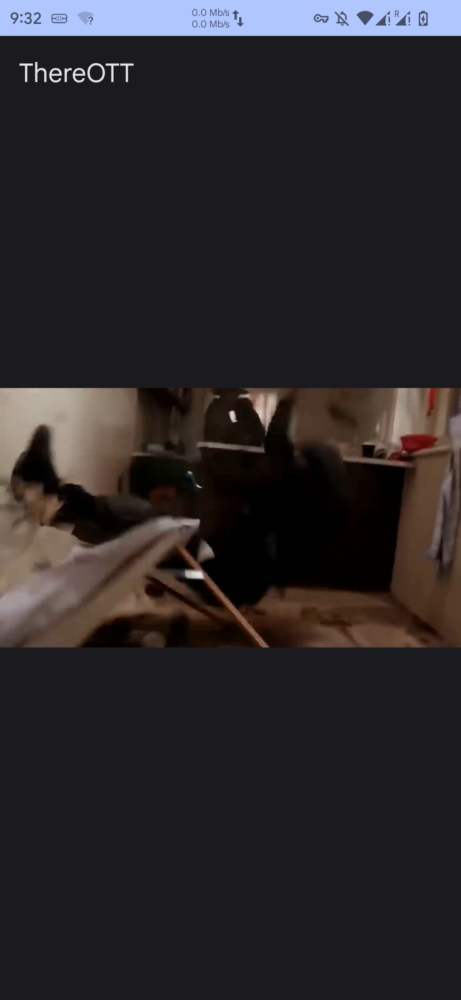

# ThereOTT

<p align="center">
    
    <br />
    <i>Main screen</i>
</p>

A medium difficulty mobile challenge where a single APK is given to us, with some basic video player functionality.

> Download my new app and watch the latest sick memes! 🤪 I have had some struggles with skids trying to DDoS this service. And while my backend is super-dooper fast, this has caused certain hiccups as the requested videos were sometimes large. So I came up with a revolutionary DDoS protection solution. It has worked perfectly so far, no one could ever crack it. But in case anyone manages to, I am offering them a fat bounty in challenge points. There is a `/flag` endpoint for bounty hunters. Do a successful request, submit the proof and earn your bounty!
>
> Here is a boilerplate for you without the revolutionary skid protector yet:
>
```py
import requests

url = "http://replacehost:replaceport"

def main():
    r = requests.post(url + "/flag", data="flag")
    print(r.text)

if __name__ == "__main__":
    main()
```

> VPN is required to access this challenge. You do NOT need a physical Android device to solve this challenge.

## How to run

The image was tested with podman, but should work fine with docker as well.

0. Clone the repo and cd to the root folder of the particular challenge
1. Optionally build the mobile-utils source: `./mobile-app/mobile-utils/build.sh build` _(**NOTE**: the build argument is important, otherwise the image won't be prepared)_
2. Optionally build the mobile-native source: `./mobile-app/mobile-native/build.sh build` _(**NOTE**: the build argument is important, otherwise the image won't be prepared)_
3. Optionally build the mobile app: `./mobile-app/build.sh build` _(**NOTE**: the build argument is important, otherwise the image won't be prepared)_
   - whenever this step asks for a password, insert the one from [mobile-app/assets/gen_key.sh](mobile-app/assets/gen_key.sh) (the password is in a comment)
4. Package and build the final container: `podman build -t ctf-thereott:latest .`
5. Run it (feel free to replace the port): `podman rm -f thereott; podman run -d --name=ctf-thereott -p 8080:8080 -e BACKEND_PORT=8080 ctf-thereott:latest`
6. Share the [app-release.apk](mobile-app/out/app-release.apk) file with the participants

<details>
<summary>Writeup (Spoiler)</summary>

Once we load the file up in [jadx-gui](https://github.com/skylot/jadx), we can immediately see the presence of some native libs, namely `libantiskid.so` and `libutils.so`. They are present for `x86_64`, `armeabi-v7a`, and `arm64-v8a` architectures under the Resources/lib tab. This suggests that we probably have to deal with some native code and JNI.

If we take a look at the decompiled `MainActivity` code, we can see that it has been compiled with ProGuard, as the class and method names are obfuscated. However, we can still see that the app uses ExoPlayer to display a video and it defines a few addresses and an API endpoint:

```java
    /* renamed from: F */
    public final String[] f3754F = {"http://10.10.1.11:7385", "http://10.10.2.11:7385", "http://10.10.3.11:7385", "http://10.10.4.11:7385", "http://10.10.5.11:7385", "http://10.10.6.11:7385", "http://10.10.7.11:7385", "http://10.10.8.11:7385", "http://10.10.9.11:7385"};

    /* renamed from: G */
    public final String f3755G = "/api/video.mp4";
```

The first string array probably contains a list of backend servers to do load balancing between them. We can confirm that all these IPs belong to the challenge hosting infrastructure. And it's great that it's plain HTTP, therefore we can easily intercept the traffic. The second string is probably the endpoint to some video file. We can try to put the URL together and see if we can access the video file directly:


```
[steve@todo ctf-thereott]$ curl http://10.10.1.11:7385/api/video.mp4
<!DOCTYPE html>
<html lang="en">
<head>
<meta charset="UTF-8">
<meta name="viewport" content="width=device-width, initial-scale=1.0">
<title>Skid Detected!!!!4444!!!!</title>
<meta name="description" content="Advanced Anti-DDoS protection triggered. No dodos please">
[...]
<p>REASON: <span id="reason">Missing signature</span></p>
[...]
```

Nope, it doesn't really work. If we Wireshark the traffic, we can see that the requests from the mobile app succeed and end up in a redirect to a direct media URL. Seemingly it sends these headers extra:

```
"x-tott-app-id": "hu.honeylab.hcsc.thereott",
"x-tott-app-name": "ThereOtt",
"x-timestamp": "1634567890",
"x-signature": "..."
```

We are missing that, so it would explain the previous `Missing signature` message. It's time to take a poke at the source code to check how that is generated. If we go back to jadx, it becomes clear to us after some digging:

```java
    public final Object mo139l(Object obj) {
        String str;
        String str2;
        InterfaceC1410u interfaceC1410u = this.f9622x;
        EnumC0388a enumC0388a = EnumC0388a.f1700o;
        int i = this.f9619u;
        InterfaceC2044m1 interfaceC2044m1 = this.f9623y;
        try {
            if (i == 0) {
                AbstractC2234w.m1598M(obj);
                String valueOf = String.valueOf(System.currentTimeMillis());
                MainActivity mainActivity = this.f9620v;
                String genSignature = UtilsJNI.genSignature("GET", mainActivity.f3755G, "", "x-tott-app-id:hu.honeylab.hcsc.thereott,x-tott-app-name:thereott", "", valueOf);
                String str3 = this.f9621w + mainActivity.f3755G;
                AbstractC2808s.m351g(genSignature);
                this.f9617s = valueOf;
                this.f9618t = genSignature;
                this.f9619u = 1;
                obj = MainActivity.m3719g(mainActivity, str3, valueOf, genSignature, this);
                if (obj == enumC0388a) {
                    return enumC0388a;
                }
                str = valueOf;
                str2 = genSignature;
            } else if (i != 1) {
                throw new IllegalStateException("call to 'resume' before 'invoke' with coroutine");
            }
[...]
```

So our signature is generated by the `UtilsJNI.genSignature` method. A-ha! It also has some arguments. We can check the signature too:


```java
package hu.honeylab.hcsc.thereott;

/* loaded from: classes.dex */
public abstract class UtilsJNI {
    static {
        System.loadLibrary("antiskid");
    }

    public static native String genSignature(String str, String str2, String str3, String str4, String str5, String str6);
}
```

Okay, that means that all of the signature generation happens within native methods. At this point, one can try to reverse engineer both libraries, but that's an awfully long and tedious process. We can try to hook the call instead using [Frida](https://frida.re/). A great tool to hook both Java and native methods.

We know that we need to call `/flag` with a POST request and `flag` body. So we can probably guess from the signature used by the app that the first `GET` argument should be `POST`, the second argument is probably the path, so it should be `/flag` in our case. We can leave the next argument empty and the next one is probably the request headers in order. We can just copy the headers as-is: `x-tott-app-id:hu.honeylab.hcsc.thereott,x-tott-app-name:thereott`. Now comes another empty string which is probably for the request body. We need to supply `flag` here.

Thankfully the app already calls this method, so all we have to do is hooking the original method and changing the arguments. We can do this with the following Frida script: [assets/frida-script.js](assets/frida-script.js).

First we can start the `frida-server` binary on the device / rooted emulator:

```
[steve@todo ~]$ adb shell
* daemon not running; starting now at tcp:5037
* daemon started successfully
davinci:/ $ su
davinci:/ # cd /da
data/         data_mirror/
davinci:/ # cd /data/local/tmp/                                                                                                                                                                                                            
davinci:/data/local/tmp # ./frida-server
```

After that we are ready to run the Frida script, assuming we have the app installed already:

```
[steve@todo ctf-thereott]$ frida -U -f hu.honeylab.hcsc.thereott -l assets/frida-script.js 
     ____
    / _  |   Frida 16.2.1 - A world-class dynamic instrumentation toolkit
   | (_| |
    > _  |   Commands:
   /_/ |_|       help      -> Displays the help system
   . . . .       object?   -> Display information about 'object'
   . . . .       exit/quit -> Exit
   . . . .
   . . . .   More info at https://frida.re/docs/home/
   . . . .
   . . . .   Connected to Mi 9T (id=00001337)
Spawned `hu.honeylab.hcsc.thereott`. Resuming main thread!              
[Mi 9T::hu.honeylab.hcsc.thereott ]-> Generated signature and timestamp: NpWvw4oyklcZco93j9rm04TUSmA= 1712738874550
```

Sick, we got a signature! Let's see if we can use that to request the flag:

```
[steve@todo hcsc-2024]$ curl http://10.10.1.11:7385/flag -H 'x-tott-app-id: hu.honeylab.hcsc.thereott' -H 'x-tott-app-name: ThereOtt' -H 'x-timestamp: 1712738874550' -H 'x-signature: NpWvw4oyklcZco93j9rm04TUSmA=' --data flag
HCSC24{3v3n_n@t1v3s_c4n_b3_h00k3d}
```

The values are case sensitive, but oh well, we got the flag! 🚩

I have also included a fully automated solver script, which you can find under [poc2.py](poc2.py). It uses the same technique, but also submits the flag to the backend automatically:

```
[steve@todo ctf-thereott]$ python3 ./poc2.py 
{'type': 'script_start', 'message': 'Frida script started'}
{'type': 'send', 'payload': {'type': 'send', 'signature': 'b5OvvMX3m3NudsbBdRpDFBEZZ8M=', 'timestamp': 1712739159775}}
Flag:  HCSC24{3v3n_n@t1v3s_c4n_b3_h00k3d}
```

Finally, there is another PoC for those who went with the static analysis way and reversed the algorithms. You can find it under [poc.py](poc.py):

```
[steve@todo ctf-thereott]$ python3 ./poc.py 
HCSC24{3v3n_n@t1v3s_c4n_b3_h00k3d}
```

Basically the native JNI library is written in C and it recontstructs a key's first two parts. The first part is `rot47` on a hardcoded string that is divided into two parts. Then the second part is literally just the ASCII code `chr(ord(p) - 33)`. It then tries to load `libutils.so` which does the rest of the heavy lifting. It's written in Go, therefore a little harder to reverse engineer. First it recovers the third part from a hardcoded string using ChaCha20Poly1305, where the pre-defined key is `Porcica1Porcica10000000000000000`. and the ciphertext is base64 encoded. Once the key is fully recovered, it becomes `K7Sx5Io4gYXH4yQTTv25P7NQA9nQnuSq7ifXUiRf` and that will be used using the HMAC-SHA1 algorithm to sign requests.

Finally, the signature is calculated over this string:

```py
def gen_signature(
    method, path, responseCode, clientId, version, headers, timestamp, body
):
    msg = f"{method}\n{path}\n{responseCode}\n{version}\n{clientId}\n{md5_hash(headers)}\n{timestamp}\n{md5_hash(body)}"
    return sign_hmac(hmac_key, msg).decode()
```

I can also imagine that someone grabs the natives and writes an app that does the same thing, but in the end they get the same result with a little more work. Frida can also be used without root if they repackage the app with the Frida gadget. There is no signature verification on the app side, so it's relatively easy to do.

Another super interesting approach would be [emulation](https://github.com/AeonLucid/AndroidNativeEmu). However that one lacks pthread support and libutils.so uses it (golang ftw). In Android's bionic libc pthread support is annoying in general, but not impossible to add it ourselves. There is a [fork](https://github.com/maiyao1988/ExAndroidNativeEmu) that even implements this along with many other features. I managed to get the library to load and I could even call the exported symbol, but never figured out how can I read the return values. This way is definitely possible, the question is rather if anyone is willing to go through all the hassle when you get the super obvious Frida way.

</details>